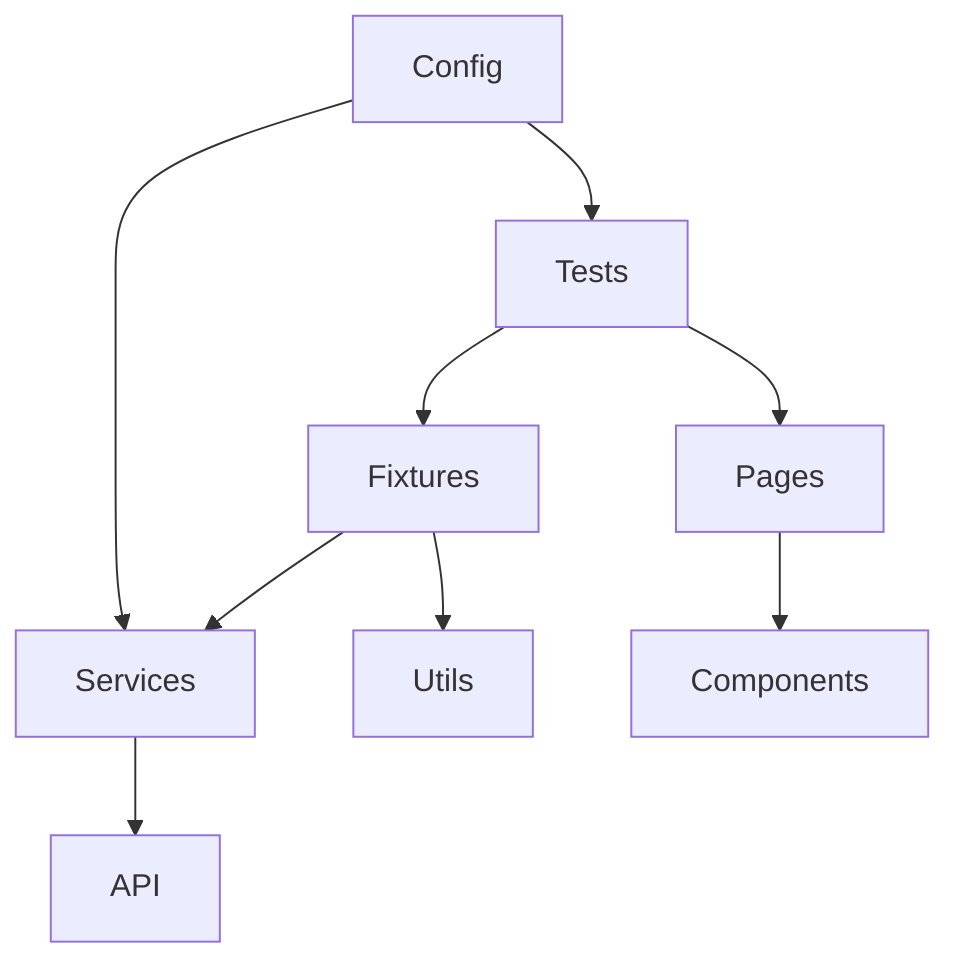

# Playwright E2E Automation Framework — Portfolio

[](https://github.com/bsyla/Playwright-AutomationExercise/actions/workflows/playwright.yml)


This repository is a production-grade E2E automation platform built to showcase Senior SDET ownership.
It demonstrates architecture discipline, deterministic selectors, API-assisted setup, and CI-ready workflows
using Playwright + TypeScript.

## Why this exists

Hiring managers want evidence of engineering judgement, not just passing tests. This framework shows how
I design for maintainability, determinism, and CI stability while keeping tests expressive and parallel-safe.

## Architecture at a glance



### Folder structure

```
src/
  config/         # env loading + runtime configuration
  components/     # reusable UI parts (header, widgets)
  pages/          # Page Objects (UI-only operations)
  fixtures/       # test data factories + custom fixtures
  services/       # API/state setup helpers
  tests/          # business-flow specs
  utils/          # shared helpers
  types/          # shared type definitions
```

## Framework features

- Page Objects expose UI intent only (no business logic inside tests)
- API-assisted account setup with UI fallback
- Custom fixtures for pages, services, and data factories
- Deterministic selectors (`data-qa` via `testIdAttribute`)
- Session reuse via storage state (`.auth/user.json`)
- Tagged suites (`@smoke`, `@regression`)
- Smart waits with `expect.poll` for dynamic UI states
- HTML reports + CI artifact upload (optional Allure)
- Parallelization tuned for CI stability

## Test coverage highlights

- User registration, login, logout, account deletion
- Cart CRUD (add, update quantity, remove)
- Checkout + payment happy path
- Validation errors and negative authentication
- Guest vs authenticated access control

## Environment configuration

```
cp .env.example .env
```

Key inputs:
- `TEST_ENV=local|staging|prod`
- `BASE_URL_*` per environment
- `API_BASE_URL` optional override
- `AUTH_STORAGE_STATE` to change storage path

## Running locally

```
npm install
npm run test
npm run test:smoke
npm run test:regression
npm run test:headed
npm run report
```

## CI/CD (GitHub Actions)

The pipeline runs on pull requests and pushes with a browser matrix. It:

1. Installs dependencies
2. Installs Playwright browsers
3. Runs tests by project (Chromium + Firefox)
4. Uploads HTML reports and traces as artifacts

## Reporting

HTML reports are generated under `playwright-report/`.

Example output:
```
✓ 18 passed (2m 14s)
✕ 1 failed (trace + video retained)
```

Enable Allure:
```
ALLURE=true npm run test
```

## Docker (optional)

```
docker build -t playwright-e2e .
docker run --rm -e TEST_ENV=staging playwright-e2e
```

---

This framework is designed to read like production QA infrastructure rather than a tutorial.
